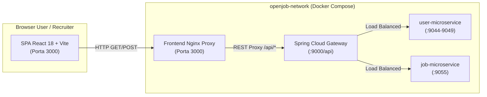
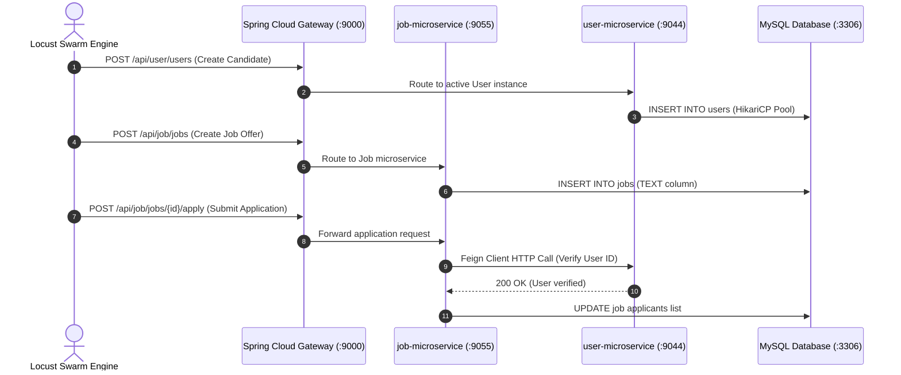
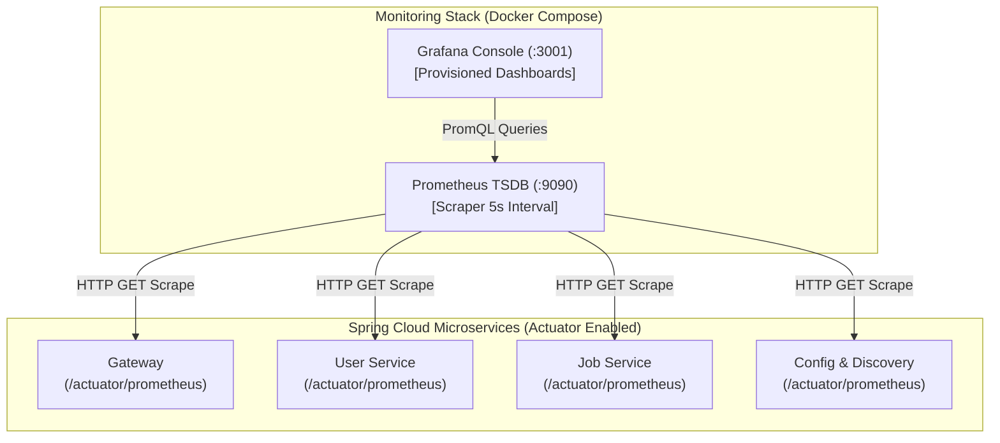

# 8_3 - Developing Microservices: dal Monolite alla Cloud-Native Observability Platform (Edizione Completa)

Questo documento contiene i testi completi delle slide, le note per lo speaker, gli schemi architetturali e i grafici per completare la presentazione dal punto in cui si era interrotta nella versione originale (**Slide 58 - Running Docker Compose & Dynamic Scaling**).

---

## SLIDE 59: Evolution Beyond Basic Dockerization
### Titolo:
**Oltre il Docker Compose di base: verso un Ecosistema Full-Stack Observability & SPA**

### Punti Chiave (Bullet Points):
* **Fino alla Slide 58:** Il sistema era composto dai microservizi di backend (`config-server`, `discovery-server`, `gateway`, `user-microservice`, `job-microservice`) e dal database `openjob-mysql` su rete Docker.
* **Le Nuove Sfide Architetturali:**
  1. **User Experience & Interattività:** Necessità di sostituire interfacce monolitiche o semplici pagine statiche con una **Single-Page Application (SPA)** moderna, reattiva e disaccoppiata.
  2. **Domain Business Intelligence:** Separare chiaramente le **metriche di business/dominio** (utenti attivi, offerte, candidature) dalle **metriche di infrastruttura**.
  3. **Resilienza e Integrità dei Dati:** Gestione avanzata di testi estesi (`TEXT` vs `VARCHAR`) per evitare crash ed errori di troncamento nel database MySQL.
  4. **Automated Load Testing:** Simulazione realistica e continua del traffico di utenti e recruiter ad alta concorrenza.
  5. **Enterprise Full-Stack Telemetry:** Monitoraggio centralizzato in tempo reale su latenze, pool delle connessioni (`HikariCP`), risorse JVM ed errori log tramite **Prometheus e Grafana**.

---

## SLIDE 60: Modern Single-Page Application (SPA) Frontend Re-Architecture
### Titolo:
**Re-Ingegnerizzazione del Frontend: React 18 + TypeScript + Vite**

### Punti Chiave:
* **Nuovo Stack Tecnologico All'avanguardia:**
  * **Core Logic:** React 18 con **TypeScript** per garantire type-safety stresso su tutte le entità (`User`, `Job`, `ApplicationRow`).
  * **Build & Dev Engine:** **Vite** con Hot Module Replacement (HMR) fulmineo (`>1740 moduli trasformati in <3.5 secondi` durante la build di produzione).
  * **Styling & UI System:** **Tailwind CSS + Radix UI Primitives + Lucide Icons** per un'interfaccia enterprise con design system coerente, badge di stato dinamici e ombreggiature morbide (`shadow-soft`).
* **Integrazione con il Backend:**
  * Il frontend comunica in modo disaccoppiato e sicuro esclusivamente con lo **Spring Cloud Gateway (`http://localhost:9000/api/*`)**, sfruttando il routing centralizzato verso i microservizi `user` e `job`.

### Grafico / Schema (Architettura Frontend-Gateway):


---

## SLIDE 61: Domain Business Intelligence & KPI Dashboard (`/statistiche`)
### Titolo:
**Domain BI: Monitoraggio delle Metriche di Business nel Frontend**

### Punti Chiave:
* **Separation of Concerns (Dominio vs Infrastruttura):**
  * **Grafana** è dedicato al monitoraggio sistemico/infrastrutturale (CPU, JVM, latenze di rete).
  * Il **Frontend React (`/statistiche`)** ospita la nuova Dashboard di Business Intelligence dedicata all'amministratore e ai recruiter.
* **KPI e Metriche di Dominio Visualizzate:**
  * **Utenti Totali Registrati & Utenti Attivi:** Contenitori di metriche live sull'adozione della piattaforma.
  * **Offerte di Lavoro & Candidature inviate (Ultime 24h):** Monitoraggio del flusso di ingaggio e del rapporto di conversione (`Tasso Candidature / Offerte`).
  * **Leaderboard dei Recruiter:** Classifica in tempo reale dei recruiter più attivi basata sul volume di offerte pubblicate e sul numero di candidati attratti.

---

## SLIDE 62: Dynamic UX: Drawers, Sorting & Live Search
### Titolo:
**Interattività e UX Dinamica: Drawers, Ordinamento Multi-Criterio e Ricerca Istantanea**

### Punti Chiave:
* **Ispezioni Non-Distruttive tramite Drawers (`Sheet/Drawer`):**
  * Apertura di pannelli laterali scorrevoli (`JobDetailDrawer`, `UserDetailDrawer`, `ApplicationDetailDrawer`) per visualizzare candidature e dettagli tecnici senza perdere il contesto della tabella principale.
* **Supercharging di Tutte le Liste (`DataTable`) nel Frontend:**
  * **Ordinamento Multi-Criterio Reattivo (`useMemo`):** Implementato su `ApplicationsTable`, `JobTable`, `UserTable` e sulle liste interne ai cassetto (`JobDetailDrawer`).
  * **Criteri Supportati:** Ordine cronologico (*Più recenti/Più vecchi*), Ordine alfabetico per nome candidato o titolo (*A-Z / Z-A*), e ordinamento per ID crescente/decrescente (`Job ID`, `User ID`).
  * **Barra di Ricerca Live:** Filtro testuale immediato su nomi, username, indirizzi email, ID numerici e descrizioni delle offerte.

---

## SLIDE 63: Frontend Containerization & Nginx Reverse Proxy
### Titolo:
**Containerizzazione del Frontend: Multi-Stage Docker Build + Nginx**

### Punti Chiave:
* **Multi-Stage Build Ottimizzata (`Dockerfile` del Frontend):**
  * **Stage 1 (Build Engine):** Base image `node:22-alpine` per installare le dipendenze (`npm ci`) e compilare il bundle statico ottimizzato e compresso (`npm run build`).
  * **Stage 2 (Production Runtime):** Base image ultraleggera `nginx:1.27-alpine` (`~25MB`). I file statici della cartella `/app/dist` vengono copiati in `/usr/share/nginx/html`.
* **Configurazione Nginx Enterprise (`nginx.conf`):**
  * **SPA History API Fallback:** Configurazione di `try_files $uri $uri/ /index.html;` per supportare il routing client-side senza errori `404 Not Found`.
  * **Reverse Proxy verso il Gateway:** Risoluzione DNS interna al container verso `http://gateway:9000/` per tutte le chiamate `/api/`.

---

## SLIDE 64: Database Evolution & Rich Text Persistence
### Titolo:
**Evoluzione dello Strato Dati: JPA Rich Text Support (`TEXT` vs `VARCHAR`)**

### Punti Chiave:
* **Il Problema del Troncamento Dati (`DataIntegrityViolationException`):**
  * Nel modello iniziale, il campo `description` dell'entità `Job` era mappato di default su `VARCHAR(255)`. L'inserimento di annunci lavorativi dettagliati e realistici causava eccezioni SQL e cadute delle chiamate REST.
* **La Soluzione Architetturale su Spring Boot / JPA:**
  * Modifica del mapping sull'entità `Job.java`:
    ```java
    @Column(columnDefinition = "TEXT", length = 4096)
    private String description;
    ```
  * **Resilienza dello Schema:** Sfruttando la proprietà `spring.jpa.hibernate.ddl-auto=update` insieme all'engine MySQL 8 containerizzato, il tipo di colonna è stato promosso dinamicamente a `TEXT` senza perdita di dati preesistenti.

---

## SLIDE 65: Automated Load Testing & Concurrency Simulation (Locust)
### Titolo:
**Automated Load Testing & Traffic Simulation con Python Locust**

### Punti Chiave:
* **Perché introdurre un Load Tester nel nostro Stack?**
  * Per verificare che il Gateway, il Discovery Server e le istanze dei microservizi siano in grado di reggere picchi di traffico simultaneo senza degrado di latenza o esaurimento del pool di connessioni al database.
* **La Suite di Simulazione (`locust/locustfile.py`):**
  * Sviluppata in Python con la libreria **Locust**, definisce comportamenti probabilistici per due scenari utente paralleli:
    1. **`UserBehavior` / Candidate Flow:** Registrazione utenti, query alle liste offerte ed invio massivo di candidature HTTP POST.
    2. **`RecruiterBehavior` / Admin Flow:** Creazione periodica di nuove offerte lavorative con descrizioni estese e consultazione dei candidati.

### Grafico / Schema (Locust Traffic Injection Pipeline):


---

## SLIDE 66: Locust Execution Modes (Headless CLI vs Web UI)
### Titolo:
**Modalità di Esecuzione di Locust: Automazione CLI vs Web UI Console**

### Punti Chiave:
* **Metodo 1: Headless Continuous Testing (CLI Mode):**
  * Ideale per pipeline CI/CD o test automatizzati non presidiati.
  * Comando: `python -m locust --headless -u 10 -r 2 -t 60s -f locust/locustfile.py --host http://localhost:9000`
  * Esegue la simulazione per 60 secondi generando report di sintesi su terminale e file CSV.
* **Metodo 2: Interactive Web UI Swarming (Browser Mode):**
  * Avviando `python -m locust -f locust/locustfile.py --host http://localhost:9000`, Locust espone una console interattiva su **`http://localhost:8089`**.
  * Consente di variare dinamicamente la concorrenza (`Peak Concurrency`), il tasso di ingresso (`Spawn Rate`) e di visualizzare grafici in tempo reale sui percentili di latenza (`p50`, `p95`, `p99`) e sul Throughput (`RPS`).

---

## SLIDE 67: 360° Observability Architecture (Prometheus & Grafana)
### Titolo:
**Lo Stack di Osservabilità Enterprise: Prometheus TSDB + Grafana Console**

### Punti Chiave:
* **Dal Monitoraggio Passivo a un'Architettura Telemetrica Attiva:**
  * Tutti e 5 i container Spring Boot (`config`, `discovery`, `gateway`, `user`, `job`) sono stati arricchiti con **Spring Boot Actuator** e la dipendenza **Micrometer Prometheus Registry**.
  * Ogni microservizio espone automaticamente metriche temporali standardizzate sull'endpoint `/actuator/prometheus`.
* **Architettura Pull-Based:**
  * **Prometheus (`:9090`)**: Containerizzato all'interno della rete Docker, effettua lo scraping periodico (`scrape_interval: 5s`) degli endpoint Actuator di ciascun servizio, archiviando le serie temporali nel proprio TSDB.
  * **Grafana (`:3001`)**: Si interfaccia con Prometheus per la visualizzazione grafica avanzata, con **Provisioning Automatico** (`/etc/grafana/provisioning/`) che carica istantaneamente la connessione dati e la dashboard principale all'avvio.

### Grafico / Schema (Architettura della Telemetria):


---

## SLIDE 68: The OpenJob Infrastructure Monitoring Console (Part 1)
### Titolo:
**Grafana Dashboard: Analisi Ingress, API Gateway & Inter-Service Feign Calls**

### Punti Chiave:
* La dashboard ufficiale **OpenJob Infrastructure Monitoring (`openjob_infrastructure.json`)** è strutturata in **6 sezioni diagnostiche di livello enterprise**:
  1. **API Gateway & Ingress Traffic:**
     * **Throughput (req/sec):** Misura il volume globale delle richieste in entrata.
     * **Latency Spectrum (Max vs Avg ms):** Confronta il tempo di risposta medio con i picchi massimi per individuare colli di bottiglia nei controller.
     * **HTTP Status Code Distribution:** Suddivisione immediata tra successi (`2xx`), errori di validazione (`4xx`) ed errori server (`5xx`).
  2. **Top 5 Slowest API Endpoints:**
     * Tabella dinamica alimentata da query PromQL (`topk(5, max by (uri, method, instance) ... )`) che identifica in tempo reale le singole rotte HTTP più lente.
  3. **Inter-Service Feign & HTTP Client Latency:**
     * Traccia le latenze e i fallimenti delle chiamate sincrone effettuate da `job-microservice` verso `user-microservice` tramite il client **Spring Cloud OpenFeign**.

---

## SLIDE 69: The OpenJob Infrastructure Monitoring Console (Part 2)
### Titolo:
**Grafana Dashboard: Database Pool, Risorse JVM & Event Log Interception**

### Punti Chiave:
* **Sezioni Diagnostiche 4, 5 e 6 della Dashboard Grafana:**
  4. **HikariCP Database Connection Pool Saturation:**
     * Monitora in tempo reale l'efficienza del pool di connessioni MySQL per ogni microservizio.
     * Traccia il tempo di attesa per l'acquisizione della connessione (`hikaricp_connections_acquire_seconds_max`) e il numero di connessioni attive vs inattive.
  5. **JVM Compute & Live Thread States:**
     * **Heap Memory Saturation:** Percentuale di memoria RAM allocata e utilizzata dai container Java.
     * **GC Stop-the-World Pauses:** Durata e frequenza delle pause del Garbage Collector (`jvm_gc_pause_seconds`).
     * **Thread State Matrix:** Monitoraggio dei thread Java suddivisi in `RUNNABLE`, `WAITING`, `TIMED_WAITING` e `BLOCKED` (fondamentale per rilevare thread starvation).
  6. **Real-Time Application Log Event Counter:**
     * Intercettazione in tempo reale di tutti gli eventi di log generati da Slf4j/Logback. Monitora il tasso al secondo dei log di livello `WARN` ed `ERROR`, permettendo di allertare l'operatore prima di un crash di sistema.

---

## SLIDE 70: Complete Full-Stack Docker Compose Topology
### Titolo:
**Topologia Completa dell'Ecosistema Containerizzato (`docker-compose.yml`)**

### Punti Chiave:
* L'intera piattaforma è ora orchestrata da un unico file `docker-compose.yml` che avvia e collega **10 container specializzati** sulla rete isolata `openjob-network`:
  1. `config-server` (Porta 8888): Repository centralizzato delle configurazioni.
  2. `discovery-server` (Porta 8761): Server Eureka per la registrazione dinamica delle istanze.
  3. `gateway` (Porta 9000): Spring Cloud Gateway e Load Balancer di ingresso.
  4. `user-microservice` (Porte dinamiche 9044-9049): Gestione anagrafica e candidati.
  5. `job-microservice` (Porta 9055): Gestione annunci, descrizioni estese e candidature.
  6. `openjob-mysql` (Porta 3306): Database relazionale MySQL 8 persistito su volume Docker.
  7. `openjob-phpmyadmin` (Porta 8081): Console web opzionale per l'ispezione diretta delle tabelle SQL.
  8. `frontend` (Porta 3000): Nginx Reverse Proxy & React 18 SPA static bundle.
  9. `prometheus` (Porta 9090): Time-Series Database & Actuator Scraper.
  10. `grafana` (Porta 3001): Visualizzazione telemetrica Enterprise con Provisioning automatico.

### Tabella Riassuntiva delle Porte Esposte:
| Servizio / Container | Porta Host | Protocollo / Tecnologia | Ruolo nell'Architettura |
| :--- | :---: | :--- | :--- |
| **Frontend SPA** | `3000` | HTTP / Nginx + React | Interfaccia utente web e Dashboard BI |
| **API Gateway** | `9000` | HTTP / Spring Cloud | Entry point unico per le API (`/api/*`) |
| **Eureka Discovery** | `8761` | HTTP / Netflix Eureka | Registro delle istanze e Health check |
| **Config Server** | `8888` | HTTP / Spring Cloud Config | Servizio di configurazione centralizzata |
| **User Microservice** | `9044+` | HTTP / Spring Boot 3 | API Gestione Utenti |
| **Job Microservice** | `9055` | HTTP / Spring Boot 3 | API Offerte e Candidature |
| **MySQL Database** | `3306` | TCP / MySQL 8 | Storage relazionale persistente |
| **PhpMyAdmin** | `8081` | HTTP / PHP | Admin GUI per MySQL |
| **Locust Web UI** | `8089` | HTTP / Python | Load Testing & Traffic Simulation Console |
| **Prometheus TSDB** | `9090` | HTTP / Prometheus | Scraper telemetrico e Database serie temporali |
| **Grafana Dashboard** | `3001` | HTTP / Grafana | Visualizzazione telemetria in tempo reale |

---

## SLIDE 71: Summary & Architectural Achievements
### Titolo:
**Conclusioni: i Traguardi della Nuova Architettura OpenJob**

### Punti Chiave:
* **Disaccoppiamento Completo & Cloud-Readiness:** Passaggio definitivo dal monolite iniziale a un'architettura microservizi resiliente, scalabile orizzontalmente e interamente containerizzata.
* **Separazione della BI dall'Osservabilità:**
  * I Recruiter e i Manager consultano le **Metriche di Dominio (`/statistiche`)** direttamente dall'interfaccia React ad alte prestazioni.
  * Gli Ingegneri DevOps e i Sistemisti controllano la **Salute Infrastrutturale e JVM** dalla console **Grafana (`:3001`)**.
* **Affidabilità Comprovata Sotto Carico:** Grazie allo stress testing continuo con **Locust** e alla telemetria al secondo di **Prometheus**, il sistema garantisce stabilità, isolamento dei guasti e rapidi tempi di ripristino in qualsiasi scenario operativo.
